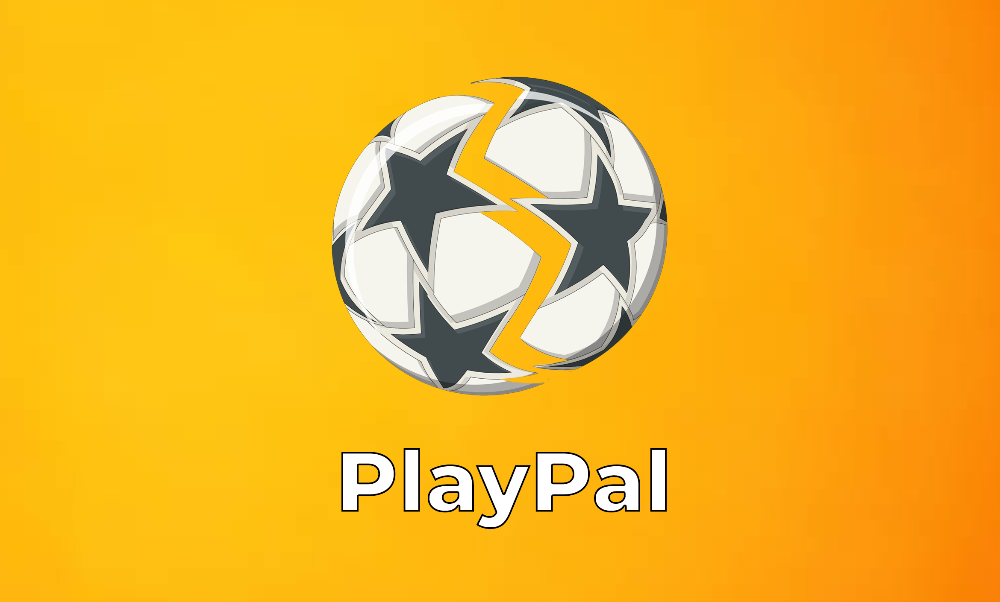
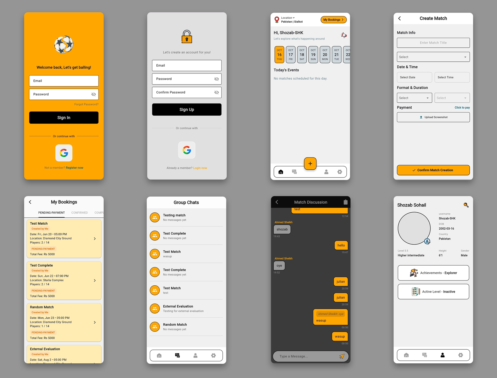

# 📱 PlayPal

> A Flutter-powered social + sports coordination app for organizing games, chatting with teammates, and keeping the fun alive.  
> Built because every weekend plan deserves fewer “who’s in?” texts.



## Features

- 🔐 Firebase Authentication (Email, Google, Apple Sign-In)
- 🏅 Player profiles with stats and availability
- 💬 Team and match chat with media sharing
- 📅 Match scheduling & RSVP system
- 🏗️ Clean architecture using BLoC pattern
- ☁️ Firestore backend + Firebase Storage
- 📱 Cross-platform (iOS, Android, Web)

## Screenshots



## Quick Start

1. **Clone and install**
   ```bash
   git clone https://github.com//moonbase-template.git
   cd moonbase-template
   flutter pub get
   ```

2. **Setup Firebase**
   - Create project at [Firebase Console](https://console.firebase.google.com)
   - Add your app

3. **Run**
   ```bash
   flutter run
   ```

## License

MIT License - see [LICENSE](LICENSE) file

---

Created by Shozab Sohail


